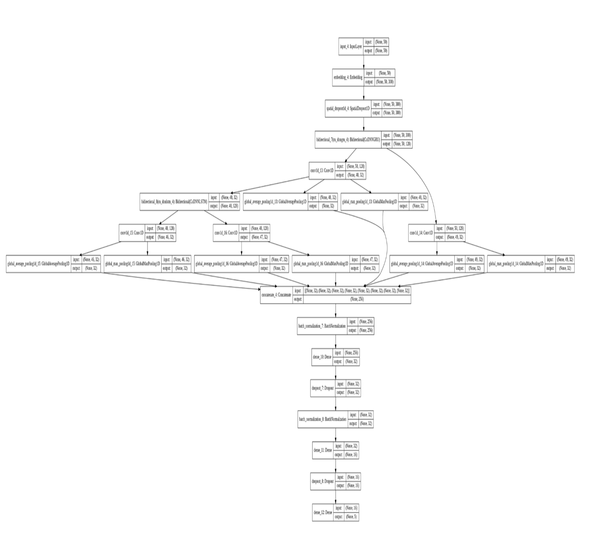

### Introduction

The goal of the project is to predict the sentiment of phrases using the labeled dataset. The data "Rotten Tomatoes movie review dataset" is a corpus of movie reviews used for sentiment analysis. This Kaggle competition has been inspired by Socher's work on labeling parsed phrases in the corpus.  
The initial phase of the project will be focusing on getting the best accuracy results using the CNN-LSTM architecture, Then other architectures will be explored to further improve on CNN-LSTM.

### Kaggle Leaderboard Top 2

Closed  competition  does  not  show  late  submissions  onthe public leaderboard,  even though it accepts late sub-missions.  The first place score of 0.99284 seems unrea-sonably high so it’s not considered in this project.  That makes the actual best score 0.71468 while the second bestscore is 0.70172.Our ensemble model that combines our five best models achieved 0.71188 on Kaggle. This result handily outper-forms the second best score is very close to the best score.

### The Architecture 
    
    
### The Model Summary

    
